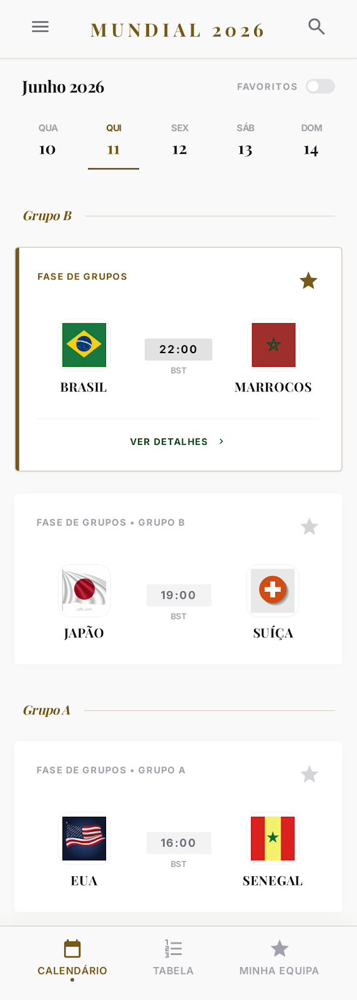
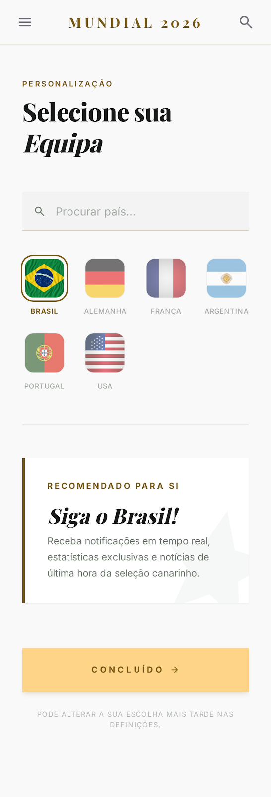
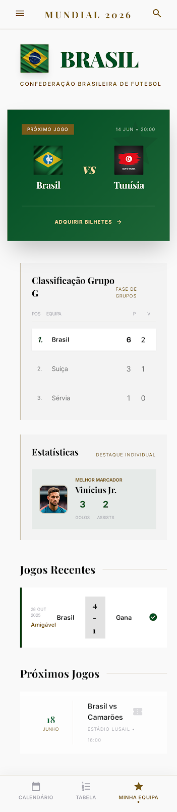
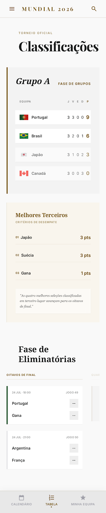

# FIFA World Cup 2026

Mobile-first web app for the FIFA World Cup 2026 (USA, Canada & Mexico). Browse the full tournament schedule, follow your favourite teams, run a betting pool with friends — including tournament-wide "special" bets and group stats — and track live scores.

**[Open the app →](https://wc26.martinsnuno.com/)** &nbsp;·&nbsp; **[View the landing page →](https://wc26.martinsnuno.com/landing.html)**

<p align="center">
  
  
  
  
</p>

## Features

- **Schedule** — All 104 matches across 7 phases, with venues; kick-off times and day grouping are shown **in your device's timezone**, and finished matches show the **final score and goalscorers**
- **Teams** — 48 qualified teams browsable A-Z, by group, or by confederation, each with an **official 2026 squad** (announced call-ups)
- **Favourites** — Star teams to filter their matches in "My Matches"; **synced to your account** across devices
- **Calendar export** — Add single or bulk matches to your device calendar (ICS)
- **Betting pool** — Predict match scores and compete with friends in a private group
- **Special bets** — Tournament-wide predictions worth 10 pts each: top scorer, MVP, best young player and surprise team, with a name/team **autocomplete**
- **Group stats & reveals** — After kick-off (matches) or the deadline (specials), see everyone's picks: pick distribution, consensus/contrarian badges, who-picked-what, per-match prediction breakdowns and a phase-by-phase recap
- **Anti-cheat** — Other players' picks stay unreadable until the relevant deadline — enforced server-side in Firestore rules (no peeking via dev tools)
- **Push notifications** — Optional, free web push: a match opening its predictions, a posted result, the specials deadline, and a heads-up about tomorrow's games
- **Leaderboard** — Ranking with points (5 exact / 3 outcome / 1 partial / 0 miss, plus 10 per special), **updated automatically** as results land
- **Automatic results** — A GitHub Actions cron (every 15 min) pulls finished matches and goalscorers from ESPN's public scoreboard, writes the results and scores every pool's bets — no manual entry
- **Dark mode** — Follows the system preference (`prefers-color-scheme`)
- **Bilingual** — Full Portuguese (PT) and English (EN) support

## Tech stack

| Layer | Technology |
|-------|-----------|
| Framework | React 19 |
| Build | Vite 8 |
| Styling | Vanilla CSS with custom properties (light/dark themes) |
| Auth | Firebase Auth (anonymous + Google / email linking) |
| Database | Cloud Firestore (security rules enforce anti-cheat reveals) |
| Push | Firebase Cloud Messaging + service worker |
| Results sync | ESPN public scoreboard + GitHub Actions cron + Firebase Admin SDK |
| Deploy | GitHub Pages + Firestore rules, via GitHub Actions |
| Notifications sender | GitHub Actions cron + Firebase Admin SDK (no Cloud Functions) |

## Getting started

```bash
# Clone
git clone https://github.com/martinsmdnuno/wc26.git
cd wc26

# Install
npm install

# Configure Firebase — copy and fill in your credentials
cp .env.example .env

# Run
npm run dev
```

### Environment variables

| Variable | Description |
|----------|------------|
| `VITE_FIREBASE_API_KEY` | Firebase API key |
| `VITE_FIREBASE_AUTH_DOMAIN` | Firebase auth domain |
| `VITE_FIREBASE_PROJECT_ID` | Firebase project ID |
| `VITE_FIREBASE_STORAGE_BUCKET` | Firebase storage bucket |
| `VITE_FIREBASE_MESSAGING_SENDER_ID` | Firebase messaging sender ID |
| `VITE_FIREBASE_APP_ID` | Firebase app ID |
| `VITE_FIREBASE_VAPID_KEY` | Web Push certificate public key (for notifications) |
| `VITE_FOOTBALL_DATA_API_KEY` | football-data.org API key (optional — in-app live polling only; results come from the ESPN cron) |
| `VITE_ADMIN_UID` | UID granted access to the admin panel |
| `VITE_SENTRY_DSN` | Sentry DSN (optional, error reporting) |

> **CI secrets:** the GitHub Actions workflows also need `FIREBASE_SERVICE_ACCOUNT` (a Firebase Admin SDK service-account JSON, with roles *Service Usage Consumer* + *Firebase Rules Admin*) to auto-deploy Firestore rules, send notifications and sync results.

## Project structure

```
src/
├── components/
│   ├── Autocomplete.jsx     # Keyboard-friendly player/team autocomplete
│   ├── BetCard.jsx          # Match prediction card + group reveal
│   ├── BottomNav.jsx        # Tab navigation bar
│   ├── HamburgerMenu.jsx    # Slide-out menu (profile, invite, notifications)
│   ├── Leaderboard.jsx      # Pool ranking table
│   ├── MatchBets.jsx        # Per-match group prediction stats
│   ├── PhaseFilter.jsx      # Phase selection chips
│   ├── PhaseSummary.jsx     # Post-match recap per phase
│   ├── SpecialBets.jsx      # Tournament-wide bets + "group" subtab
│   ├── SpecialStats.jsx     # Special-bet distribution / ranking
│   └── … (PoolManager, PoolSelector, TeamCard, AuthScreen, …)
├── data/
│   ├── schedule.json        # All 104 matches with venues (kickoffs in PT time, UTC+1)
│   ├── teams/*.js           # 48 official squads + editorial data
│   ├── specialBets.js       # Special categories, points, deadline
│   ├── playerIndex.js       # Flat player/team index for autocomplete
│   ├── matchLock.js         # Per-match kickoff (reveal) timestamps
│   └── confederations.js    # Team-to-confederation mapping
├── hooks/
│   ├── useAuth.jsx          # Auth (anon + Google/email) + profile
│   ├── useBets.js           # Match bet CRUD + scoring
│   ├── useFavorites.js      # Favourites synced to the user doc
│   ├── useLiveScores.js     # football-data.org polling
│   ├── useSpecialBets.js    # Special picks + correct answers
│   ├── useSpecialStats.js   # Group special-bet stats (post-deadline)
│   ├── useMatchStats.js     # Per-match group predictions (post-kickoff)
│   ├── usePhaseSummary.js   # Finished-match aggregation per phase
│   ├── useNotifications.js  # FCM permission + token registration
│   └── usePools.jsx         # Pool create/join/manage
├── i18n/                    # PT-PT & EN-GB translations
├── pages/
│   ├── Bets.jsx             # Pool: predict / specials / recap / ranking
│   ├── TeamProfile.jsx      # Team profile + official squad
│   ├── admin/               # Admin: scores, special results, pools, users…
│   └── … (Schedule, Teams, MyMatches, Rules, Missing)
├── utils/                   # calendar (ICS), matchTime (viewer-tz), scoring, logError
└── firebase.js              # Firebase config, Firestore, Messaging

public/firebase-messaging-sw.js   # FCM background service worker
scripts/send-notifications.mjs    # Notification sender (GitHub Actions cron)
scripts/sync-results.mjs          # ESPN results + scorers + pool scoring (cron)
.github/workflows/                # deploy (Pages + rules), notifications, sync-results, health
firestore.rules                   # Security rules (incl. time-gated reveals)
```

## Scoring rules

| Points | Condition | Example |
|--------|-----------|---------|
| **5** | Exact result | Predicted 2-1, result 2-1 |
| **3** | Correct outcome | Predicted 1-0, result 2-1 (home win) |
| **1** | One team's goals correct | Predicted 2-1, result 2-3 |
| **0** | Nothing correct | Predicted 0-0, result 2-1 |
| **+10** | Each correct **special** bet | Top scorer / MVP / young player / surprise team |

Tiebreak: total points > exact results > correct outcomes. Scoring runs automatically ~15 min after each final whistle (manual override available in the admin panel).

## Screens

| Schedule | Onboarding | My team | Standings |
| :---: | :---: | :---: | :---: |
|  |  |  |  |

## Design system

Visual style is documented in [`designs/campeonato_prestige/DESIGN.md`](designs/campeonato_prestige/DESIGN.md) — a "championship prestige" theme with serif headings (Oswald), DM Sans body, dark green and gold accents.

## License

MIT
