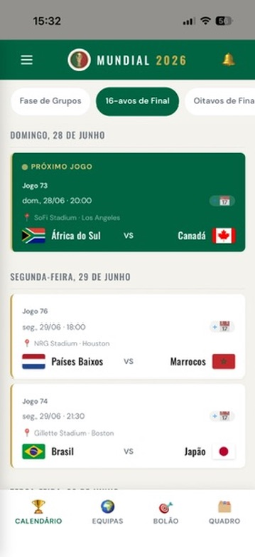
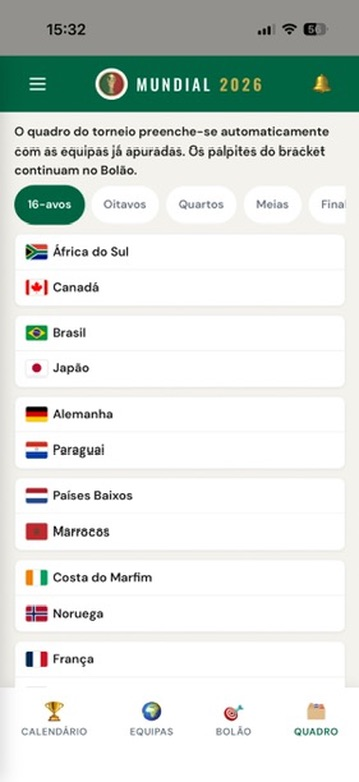
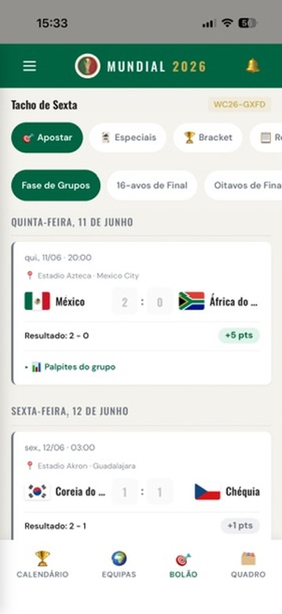
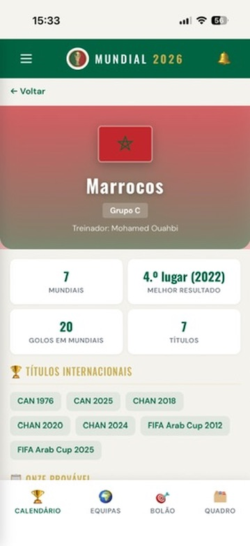
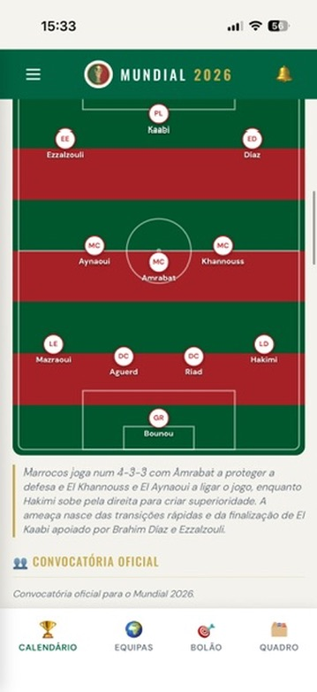

# FIFA World Cup 2026

Mobile-first web app for the FIFA World Cup 2026 (USA, Canada & Mexico). Browse the full tournament schedule, follow your favourite teams, fill in a live knockout bracket, and run a betting pool with friends — match scores, tournament-wide "special" bets, group reveals and live results.

**[Open the app →](https://wc26.martinsnuno.com/)** &nbsp;·&nbsp; **[View the landing page →](https://wc26.martinsnuno.com/landing.html)**

<p align="center">
  
  
  
  
  
</p>

## Features

- **Schedule** — All 104 matches across 7 phases, with venues; kick-off times and day grouping are shown **in your device's timezone**, and finished matches show the **final score and goalscorers**
- **Teams** — 48 qualified teams browsable A-Z, by group, or by confederation, each with an **official 2026 squad** (announced call-ups) and a pitch line-up view
- **Knockout bracket** — A two-sided bracket converging on the final. Fill in your path round by round, and as the group stage settles the real fixtures resolve **automatically** — including the 8 best third-placed teams via FIFA's official allocation table (Annexe C). Live results and per-match status are shown in-place, with a single-column "by round" view on phones
- **Favourites & My Matches** — Star teams to filter their fixtures in "My Matches"; **synced to your account** across devices
- **Calendar export** — Add single or bulk matches to your device calendar (ICS)
- **Betting pool** — Predict match scores and compete with friends in a private group. On knockout games, a draw at 90' also asks **who advances** and **how it's decided** (extra time / penalties)
- **Special bets** — Tournament-wide predictions worth 10 pts each: top scorer, MVP, best young player and surprise team, with a name/team **autocomplete**
- **Group stats & reveals** — After kick-off (matches) or the deadline (specials), see everyone's picks: pick distribution, consensus/contrarian badges, who-picked-what, per-match breakdowns and a phase-by-phase recap
- **Tournament stats** — Live top scorers and best defences, derived automatically from the synced results (Golden Boot rules — own goals excluded)
- **Profiles** — Editable nickname and an avatar picked from a gallery of **football legends** (Pelé, Cruyff, Maradona, Zidane, Eusébio…) or a custom photo
- **Anti-cheat** — Other players' picks stay unreadable until the relevant deadline — enforced server-side in Firestore rules (no peeking via dev tools)
- **Push notifications + in-app centre** — Optional, free web push (a match opening its predictions, a posted result, the specials deadline, tomorrow's games), plus an in-app notification centre to review and clear them
- **Leaderboard & certificate** — Ranking with points (5 exact / 3 outcome / 1 partial / 0 miss, plus 10 per special), **updated automatically** as results land; the group-stage winner earns the "Oráculo da Circunvalação" certificate
- **Automatic results** — A self-perpetuating GitHub Actions loop polls ESPN's public scoreboard every ~3 min during match windows, pulls finished matches and goalscorers, writes the results and scores every pool's bets — no manual entry (a 15-min cron acts only as a watchdog, since GitHub's scheduler is best-effort)
- **Admin panel** — Scores, special results, bracket advancers, pools, users and error logs
- **Dark mode** — Follows the system preference (`prefers-color-scheme`)
- **Bilingual** — Full Portuguese (PT) and English (EN) support

## Tech stack

| Layer | Technology |
|-------|-----------|
| Framework | React 19 |
| Build | Vite 8 |
| Animation | Framer Motion |
| Styling | Vanilla CSS with custom properties + design tokens (light/dark themes) |
| Auth | Firebase Auth (anonymous + Google / email linking) |
| Database | Cloud Firestore (security rules enforce anti-cheat reveals) |
| Push | Firebase Cloud Messaging + service worker |
| Error reporting | Sentry (optional) |
| Results sync | ESPN public scoreboard + GitHub Actions self-re-dispatching loop + Firebase Admin SDK |
| Deploy | GitHub Pages + Firestore rules, via GitHub Actions |
| Notifications sender | GitHub Actions cron + Firebase Admin SDK (no Cloud Functions) |

## Getting started

```bash
# Clone
git clone https://github.com/martinsmdnuno/wc26.git
cd wc26

# Install
npm install

# Configure Firebase — copy and fill in your credentials
cp .env.example .env

# Run
npm run dev
```

### Environment variables

| Variable | Description |
|----------|------------|
| `VITE_FIREBASE_API_KEY` | Firebase API key |
| `VITE_FIREBASE_AUTH_DOMAIN` | Firebase auth domain |
| `VITE_FIREBASE_PROJECT_ID` | Firebase project ID |
| `VITE_FIREBASE_STORAGE_BUCKET` | Firebase storage bucket |
| `VITE_FIREBASE_MESSAGING_SENDER_ID` | Firebase messaging sender ID |
| `VITE_FIREBASE_APP_ID` | Firebase app ID |
| `VITE_FIREBASE_VAPID_KEY` | Web Push certificate public key (for notifications) |
| `VITE_FOOTBALL_DATA_API_KEY` | football-data.org API key (optional — in-app live polling only; results come from the ESPN cron) |
| `VITE_ADMIN_UID` | UID granted access to the admin panel |
| `VITE_SENTRY_DSN` | Sentry DSN (optional, error reporting) |

> **CI secrets:** the GitHub Actions workflows also need `FIREBASE_SERVICE_ACCOUNT` (a Firebase Admin SDK service-account JSON, with roles *Service Usage Consumer* + *Firebase Rules Admin*) to auto-deploy Firestore rules, send notifications and sync results.

## Project structure

```
src/
├── components/
│   ├── Autocomplete.jsx          # Keyboard-friendly player/team autocomplete
│   ├── BetCard.jsx               # Match prediction card (incl. knockout advancer) + reveal
│   ├── BottomNav.jsx             # Tab bar: Schedule · Teams · Bets · Bracket
│   ├── BracketPredictor.jsx      # Interactive two-sided knockout bracket
│   ├── GroupChampionCertificate.jsx  # "Oráculo da Circunvalação" award
│   ├── GroupTable.jsx            # Computed group standings
│   ├── HamburgerMenu.jsx         # Slide-out menu (profile, My Matches, notifications)
│   ├── Leaderboard.jsx           # Pool ranking table
│   ├── MatchBets.jsx             # Per-match group prediction stats
│   ├── NotificationCenter.jsx    # In-app notification list
│   ├── PitchLineup.jsx           # Formation / line-up on a pitch
│   ├── ProfileModal.jsx          # Edit nickname + avatar (legends / photo)
│   ├── SpecialBets.jsx           # Tournament-wide bets + "group" subtab
│   ├── TournamentStats.jsx       # Live top scorers / best defences
│   └── … (PhaseFilter, PhaseSummary, PoolManager, PoolSelector, TeamCard, AuthScreen, …)
├── data/
│   ├── schedule.json             # All 104 matches with venues (kickoffs in PT time, UTC+1)
│   ├── bracket.js                # Knockout bracket model (derived from the schedule)
│   ├── thirdPlaceAllocation.js   # FIFA Annexe C best-thirds allocation table
│   ├── teams/*.js                # 48 official squads + editorial data
│   ├── formations.js             # Team formations for the pitch view
│   ├── specialBets.js            # Special categories, points, deadline
│   ├── playerIndex.js            # Flat player/team index for autocomplete
│   ├── nicknames.js              # Curated nickname suggestions
│   ├── matchLock.js              # Per-match kickoff (reveal) timestamps
│   └── confederations.js         # Team-to-confederation mapping
├── hooks/
│   ├── useAuth.jsx               # Auth (anon + Google/email) + profile
│   ├── useBets.js                # Match bet CRUD + scoring
│   ├── useBracket.js             # Bracket prediction + resolved advancers
│   ├── useFavorites.js           # Favourites synced to the user doc
│   ├── useLiveScores.js          # Live score polling
│   ├── useSpecialBets.js         # Special picks + correct answers
│   ├── useSpecialStats.js        # Group special-bet stats (post-deadline)
│   ├── useMatchStats.js          # Per-match group predictions (post-kickoff)
│   ├── usePhaseSummary.js        # Finished-match aggregation per phase
│   ├── useNotifications.js       # FCM permission + token registration
│   ├── useToast.jsx              # Toast notifications
│   └── usePools.jsx              # Pool create/join/manage
├── i18n/                         # PT-PT & EN-GB translations
├── pages/
│   ├── Bets.jsx                  # Pool: predict / specials / recap / ranking
│   ├── Bracket.jsx               # Knockout bracket page
│   ├── TeamProfile.jsx           # Team profile + official squad + line-up
│   ├── admin/                    # Admin: scores, specials, bracket, pools, users, logs
│   └── … (Schedule, Teams, MyMatches, Rules, Missing)
├── utils/                        # calendar (ICS), matchTime (viewer-tz), knockout, standings,
│   │                             #   scoring, tournamentStats, legends, phases, logError
└── firebase.js                   # Firebase config, Firestore, Messaging

public/firebase-messaging-sw.js   # FCM background service worker
public/landing.html               # Marketing landing page
scripts/send-notifications.mjs    # Notification sender (GitHub Actions cron)
scripts/sync-results.mjs          # ESPN results + scorers + pool scoring (one pass)
scripts/sync-loop.mjs             # ~55 min polling loop around sync-results (CI)
.github/workflows/                # deploy (Pages + rules), notifications, sync-results, health
firestore.rules                   # Security rules (incl. time-gated reveals)
```

## Scoring rules

Each match prediction scores against the final result:

| Points | Condition | Example |
|--------|-----------|---------|
| **5** | Exact result | Predicted 2-1, result 2-1 |
| **3** | Correct outcome | Predicted 1-0, result 2-1 (home win) |
| **1** | One team's goals correct | Predicted 2-1, result 2-3 |
| **0** | Nothing correct | Predicted 0-0, result 2-1 |
| **+10** | Each correct **special** bet | Top scorer / MVP / young player / surprise team |

Tiebreak: total points > exact results > correct outcomes. Scoring runs automatically shortly after each final whistle (manual override available in the admin panel).

The knockout **bracket** assigns escalating points for predicting how far a team goes (reaching the R16 → up to lifting the trophy as champion). The bracket and the new knockout-match deciders (advancer / extra time / penalties) are still being wired into the pool total — see the in-app rules page for the current state.

## Screens

| Schedule | Knockout bracket | Betting pool | Team profile | Probable line-up |
| :---: | :---: | :---: | :---: | :---: |
|  |  |  |  |  |

> Real screenshots from the live app (Portuguese UI). Switch the language to English from the in-app menu.

## Design system

Visual style is documented in [`designs/campeonato_prestige/DESIGN.md`](designs/campeonato_prestige/DESIGN.md) — a "championship prestige" theme with serif headings (Oswald), DM Sans body, dark green and gold accents, built on shared shape/spacing tokens.

## License

MIT
